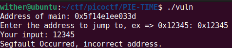
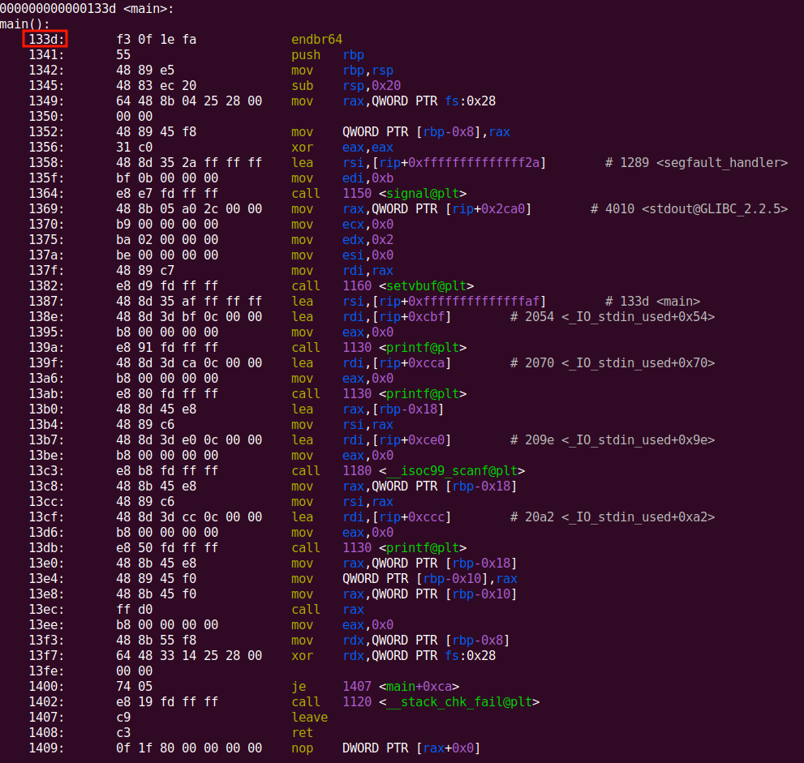
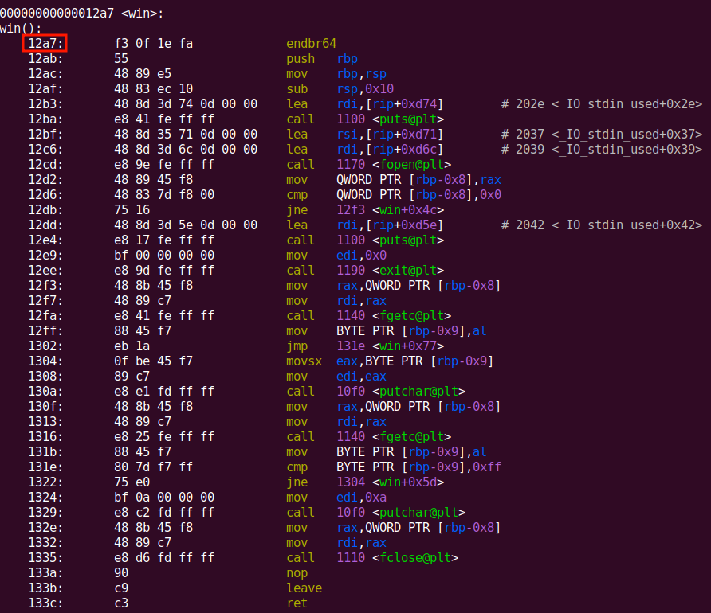
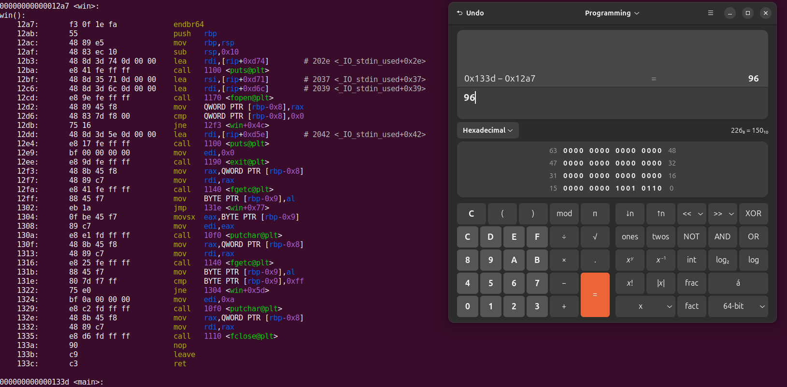
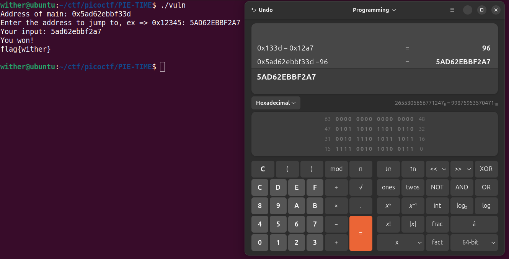
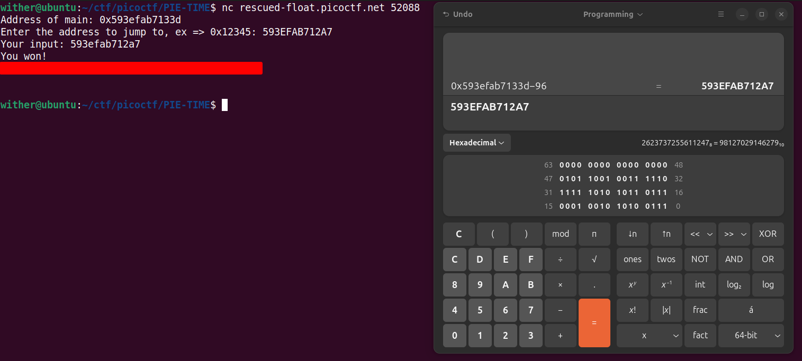

## Overview

**Challenge Author**
Darkraicg492

**Description**
Can you try to get the flag? Beware we have PIE!

## Tools Used
- checksec
- objdump
- python3-pwntools

## Manual Exploitation

#### Download the ELF

```bash
wget https://challenge-files.picoctf.net/c_rescued_float/ed56ce24317132655feefb8f448c6587198c72f1c76e54bdea9fb5d7f087397e/vuln

--2025-04-05 19:43:42--  https://challenge-files.picoctf.net/c_rescued_float/ed56ce24317132655feefb8f448c6587198c72f1c76e54bdea9fb5d7f087397e/vuln
Resolving challenge-files.picoctf.net (challenge-files.picoctf.net)... 2600:9000:23d4:9c00:e:c945:f180:93a1, 2600:9000:23d4:3400:e:c945:f180:93a1, 2600:9000:23d4:1a00:e:c945:f180:93a1, ...
Connecting to challenge-files.picoctf.net (challenge-files.picoctf.net)|2600:9000:23d4:9c00:e:c945:f180:93a1|:443... connected.
HTTP request sent, awaiting response... 200 OK
Length: 17264 (17K) [application/octet-stream]
Saving to: ‘vuln’

vuln                                      100%[====================================================================================>]  16.86K  --.-KB/s    in 0s

2025-04-05 19:43:42 (171 MB/s) - ‘vuln’ saved [17264/17264]
```

### Create a local flag.txt


```bash
echo "flag{wither}" > flag.txt
cat flag.txt 

flag{wither}
```

### Check file security

```bash
checksec --file=vuln --format=json --extended | jq .

{
  "vuln": {
    "relro": "full",
    "canary": "yes",
    "nx": "yes",
    "pie": "yes",
    "clangcfi": "no",
    "safestack": "no",
    "rpath": "no",
    "runpath": "no",
    "symbols": "yes",
    "fortify_source": "no",
    "fortified": "0",
    "fortify-able": "1"
  }
}

```

### Run




### Disassembly

```bash
objdump -M intel,x86-64 -d ./vuln --disassembler-color=extended -l
```

main 


win


### Calculating the offset




### Using the offset to leak the address of win()



### Exploiting on remote server

```bash
nc rescued-float.picoctf.net 52088
```



## Automating the Exploitation

## Local


## Remote


## Key Takeaways

## Resources
- [pwntools Documentation](https://docs.pwntools.com/en/latest/)

## Final Thoughts


